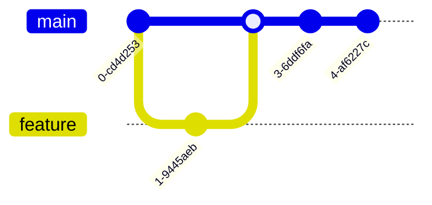

# Hi there! I'm [Your Name] 🚀

<div align="center">
  
[](https://github.com/yourusername)
[](https://github.com/yourusername)

</div>

## 🌟 Open Source Contributions

### Projects I Maintain

| Project | Description | Stars | Issues | Pull Requests |
|---------|-------------|-------|--------|---------------|
| [Project 1](https://github.com/yourusername/project1) | Description |  |  |  |
| [Project 2](https://github.com/yourusername/project2) | Description |  |  |  |

### Recent Contributions



## 📊 Contribution Stats

<div align="center">
  
[](https://github.com/yourusername)

</div>

### Languages I Contribute In

```
JavaScript   ███████████░░░░  65.3%
Python       ████░░░░░░░░░░  22.2%
Java         ██░░░░░░░░░░░░   9.1%
Other        ░░░░░░░░░░░░░░   3.4%
```

## 🤝 How to Contribute to My Projects

1. Fork the repository
2. Create your feature branch (`git checkout -b feature/amazing-feature`)
3. Commit your changes (`git commit -m 'Add some amazing feature'`)
4. Push to the branch (`git push origin feature/amazing-feature`)
5. Open a Pull Request

## 📝 Latest Blog Posts About Open Source

<!-- BLOG-POST-LIST:START -->
- [How to Start Contributing to Open Source](https://yourblog.com/post1)
- [Best Practices for Open Source Contributions](https://yourblog.com/post2)
- [My Journey in Open Source](https://yourblog.com/post3)
<!-- BLOG-POST-LIST:END -->

## 🏆 Open Source Achievements

- 🌟 Created [Project Name] with 1k+ stars
- 🛠️ Core Contributor to [Major Project]
- 📚 Wrote documentation for [Popular Library]
- 🎓 Mentored X new contributors

## 📫 Get in Touch

- Twitter: [@yourusername](https://twitter.com/yourusername)
- Blog: [Your Blog](https://yourblog.com)
- Email: opensource@yourdomain.com

---

<div align="center">
  
### Support My Open Source Work

[](https://www.buymeacoffee.com/yourusername)
[](https://github.com/sponsors/yourusername)

</div> 